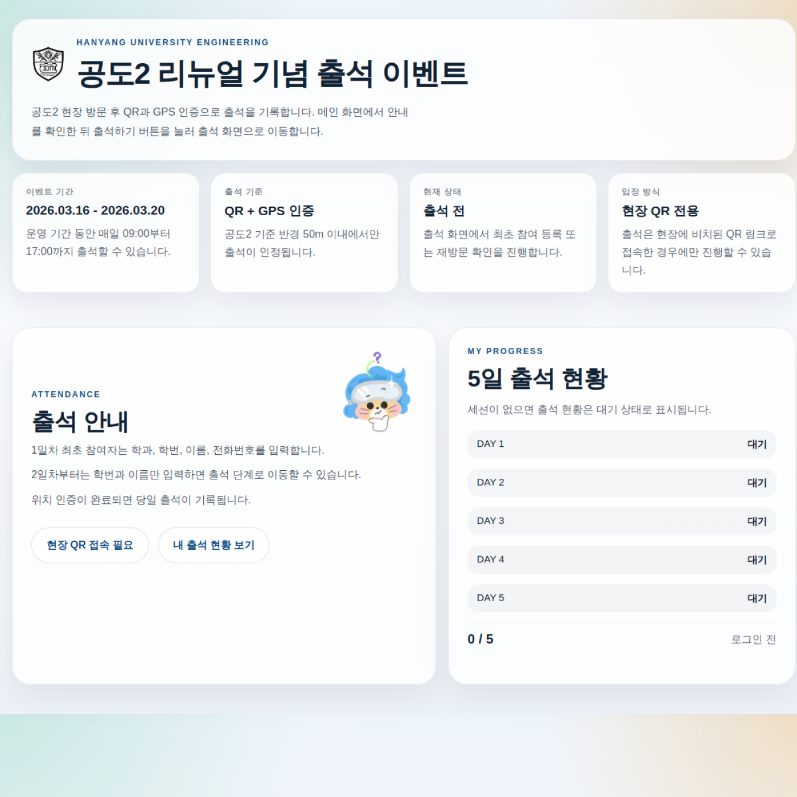
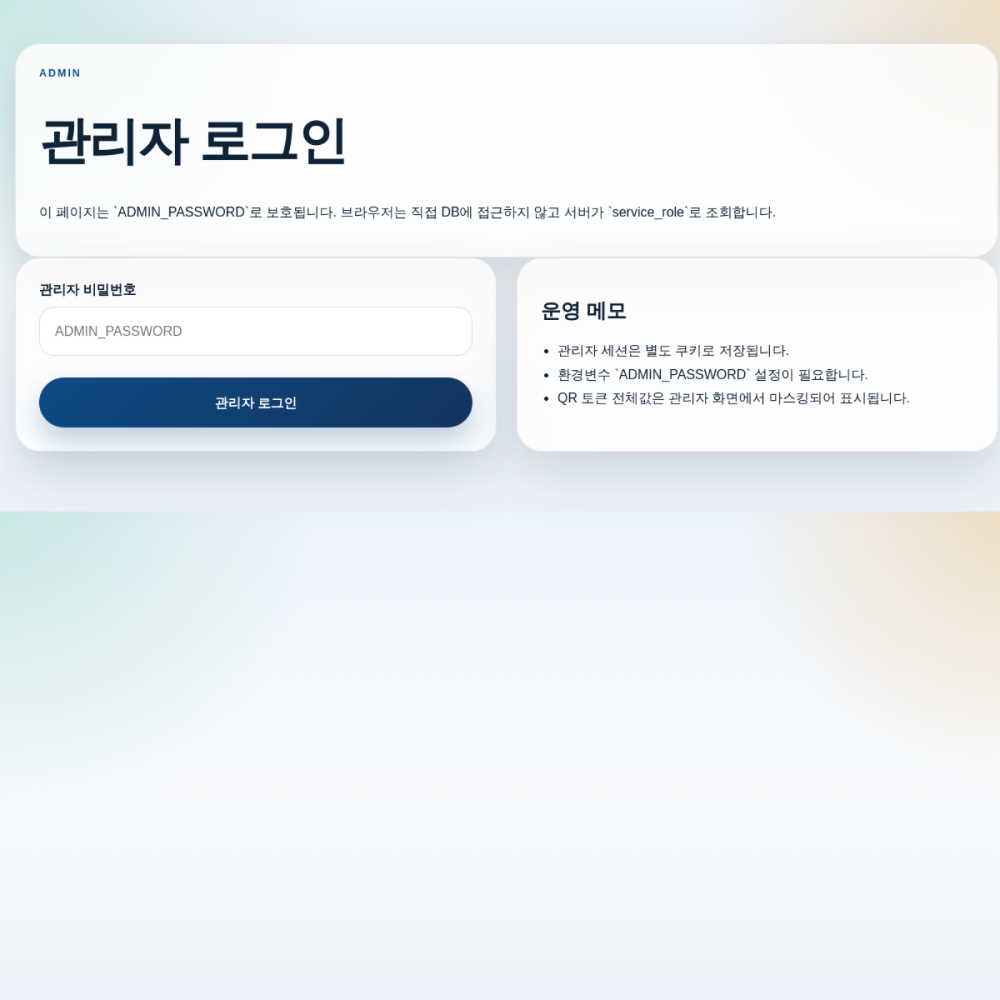
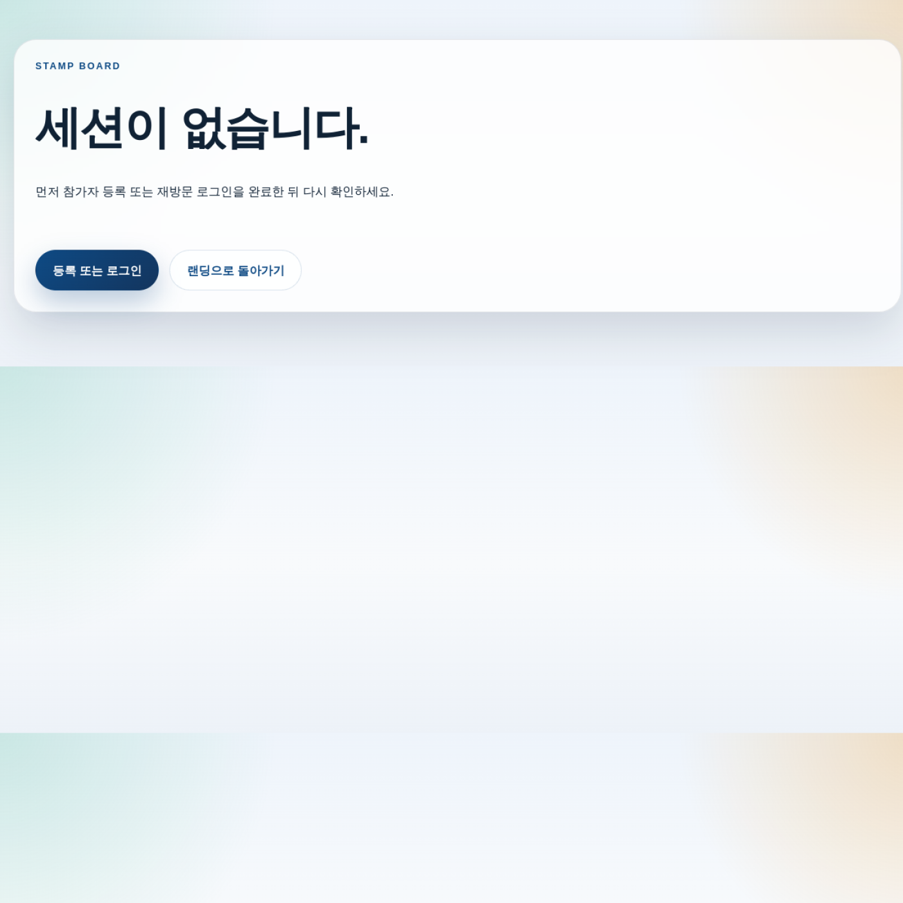

# HYU Tech Attendance Event

<p align="center">
  
  
</p>

한양대학교 공과대학 공간 리뉴얼 홍보 이벤트를 위해 만든 현장 출석 체크 웹 애플리케이션입니다.  
오프라인 공간 방문을 실제 데이터로 남겨야 했기 때문에, 단순 폼 수집이 아니라 `QR 토큰`, `GPS 반경 검증`, `연속 출석 규칙`, `관리자 운영 화면`까지 하나의 흐름으로 설계했습니다.

[Live Demo](https://hyutech-renewall-2ndgongdo-attendan.vercel.app) · [Project Spec](./PROJECT.md) · [Schema](./schema.sql) · [RPC Logic](./supabase_rpc.sql)

<!-- post-event-note:start -->
> [!IMPORTANT]
> Live event note: the event is still running until `2026-03-20` in Korea time.  
> This public repository intentionally excludes live QR artifacts such as `generated/qr` and `attendance_days.seed.sql` to avoid leaking operational tokens during the event.
<!-- post-event-note:end -->

## Overview

- Goal: convert an offline attendance event into a verifiable web flow
- Audience: Hanyang University engineering students
- Constraint: only on-site participants should be able to check in
- Duration: `2026-03-16` to `2026-03-20`, once per day between `09:00` and `17:00`

이 프로젝트의 핵심은 예쁜 랜딩 페이지보다 "현장 출석만 인정되게 만드는 운영 로직"입니다.

## Screens

| Landing | Admin |
| --- | --- |
|  |  |

추가 화면:



## What I Built

### 1. Daily QR token flow

예측 가능한 `day=1` 쿼리 대신 날짜별 랜덤 토큰을 발급하고, 서버가 해당 토큰이 실제 운영 일자와 일치하는지 다시 검증합니다.  
즉, QR 링크를 알아도 날짜가 맞지 않으면 출석이 거부됩니다.

### 2. GPS-based on-site verification

브라우저에서 받은 위경도와 행사 장소 중심 좌표를 비교해 반경 `50m` 이내에서만 출석을 허용했습니다.  
이 검증은 Route Handler와 Supabase RPC를 통해 서버 쪽에서 최종 판단합니다.

### 3. Consecutive attendance rule

이 이벤트는 5일 연속 출석이 핵심이라, 당일 출석 시점에 이전 출석 누락 여부를 검사하고 누락이 있으면 즉시 `eliminated` 상태로 전환합니다.  
이 정책은 프론트가 아니라 DB 함수에서 처리해 규칙 우회를 어렵게 했습니다.

### 4. Admin operations

관리자 화면에서 참가자 목록, 최근 출석 기록, 일자별 QR 상태, 이상 로그를 한 번에 확인할 수 있게 만들었습니다.  
추가로 CSV 다운로드와 QR 토큰 재생성 API도 따로 분리했습니다.

## Feature Set

- QR 토큰이 포함된 출석 진입 링크
- 최초 참가 등록 / 재방문 로그인 분리
- GPS 반경 검증 기반 출석 처리
- 하루 1회 제한과 연속 출석 탈락 처리
- 개인별 스탬프 보드와 프로필 수정
- 관리자 로그인과 운영 대시보드
- 참가자 / 출석 기록 CSV 내보내기
- QR 이미지 및 seed SQL 생성 스크립트

## Tech Stack

- Frontend: Next.js 15, React 19
- Backend: Next.js App Router + Route Handlers
- Database: Supabase Postgres
- Business Logic: Postgres schema + RPC functions
- Session: signed cookie session
- Deployment: Vercel
- Utilities: `qrcode`

## Architecture

```text
Participant
  -> scans daily QR
  -> enters Next.js check-in flow
  -> sends GPS + token to Route Handler
  -> Route Handler calls Supabase RPC
  -> Postgres validates date, time, radius, streak
  -> attendance record / log is stored

Admin
  -> signs in with admin password
  -> opens dashboard
  -> server fetches aggregate data through RPC
  -> CSV export / QR regeneration handled by API routes
```

비즈니스 규칙을 `supabase_rpc.sql`로 내린 이유는 검증 로직을 한 군데에 고정하기 위해서입니다.  
프론트는 UI와 입력 수집에 집중하고, 출석 인정 여부는 서버와 DB가 최종 결정합니다.

## Data Model

- `attendance_days`: 운영 일자, 시간, QR 토큰
- `participants`: 참가자 기본 정보와 상태
- `attendance_records`: 성공 출석 기록과 거리 정보
- `admin_logs`: 반경 이탈, 탈락 처리 등 운영 이벤트 로그

관련 문서:

- [schema.sql](./schema.sql)
- [supabase_rpc.sql](./supabase_rpc.sql)
- [QR_SETUP.md](./QR_SETUP.md)
- [ERD.md](./ERD.md)

## Local Setup

### Environment variables

`.env.example`을 기준으로 아래 값을 채웁니다.

```bash
NEXT_PUBLIC_SITE_URL=http://localhost:3000
NEXT_PUBLIC_EVENT_CENTER_LAT=37.556318
NEXT_PUBLIC_EVENT_CENTER_LNG=127.045965
NEXT_PUBLIC_EVENT_RADIUS_METERS=50

SUPABASE_URL=...
SUPABASE_SERVICE_ROLE_KEY=...
SUPABASE_PUBLISHABLE_KEY=...

APP_SESSION_SECRET=...
ADMIN_PASSWORD=...
```

### Install and run

```bash
npm install
npm run dev
```

### Prepare database

1. Apply [schema.sql](./schema.sql)
2. Apply [supabase_rpc.sql](./supabase_rpc.sql)

운영용 QR을 다시 생성해야 하면:

```bash
npm run generate:qr
```

## Why This Works Well As a Portfolio Project

- 단순 CRUD보다 운영 제약이 강한 문제를 실제 서비스 흐름으로 풀었습니다.
- 프론트, 서버, DB 정책, 관리자 도구까지 end-to-end로 구현했습니다.
- 사용자 경험과 운영 리스크를 동시에 고려한 설계가 드러납니다.
- "현장 인증"과 "연속 출석" 같은 비즈니스 규칙을 코드로 명확하게 표현했습니다.

## Repository Notes

- `.env` 계열 파일, live QR 산출물, build output은 커밋하지 않도록 설정했습니다.
- 이벤트 종료 후 README의 live-event 안내 문구는 GitHub Actions가 자동으로 archive 안내로 바꾸도록 예약해 두었습니다.
